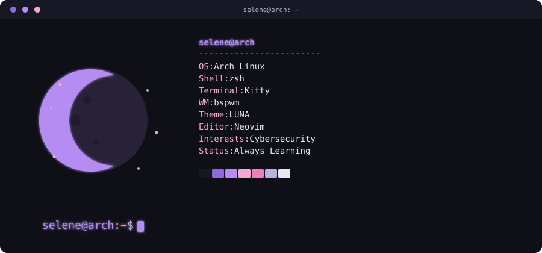

<h1>Hi, I'm Selene 👋</h1>

<h2>🌸 About Me</h2>

<table>
<tr>
<td width="65%">

I'm a **Cybersecurity graduate** from Argentina passionate about information security.

I enjoy exploring different areas of cybersecurity, including network security, cloud security, digital forensics, vulnerability management, malware analysis, and ethical hacking.

I'm constantly improving my skills through practical labs, personal projects, and cybersecurity certifications.

- 🔐 Passionate about Cybersecurity
- 🐧 Linux & Windows
- 🐍 Python for Security Automation
- 🌐 Networking & Web Security
- ☁️ Cloud Security
- 📚 Always Learning

<td align="center" width="40%">
    
</td>

</tr>
</table>

## 🛠️ Tech Stack

### 💻 Systems & Automation

---

### 🌐 Networking & Infrastructure

---

### 🔍 Reconnaissance & Enumeration

---

### 🔐 Web Security & Offensive Security

---

### 🛡️ Blue Team, Detection & DFIR

---

### ☁️ Cloud, Virtualization & Platforms

